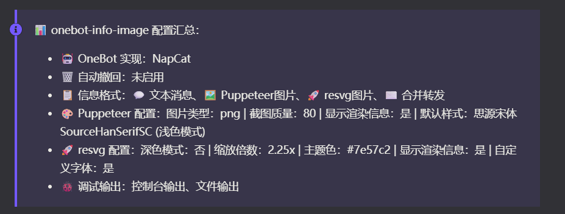

## 更新日志

- **0.6.0-beta.2+20260731** 🐛
  - 🐛 **修复生产环境类型构建失败**
    - 修复干净安装或依赖未提升环境中无法解析 `@koishijs/console` 的问题
    - 将 `@koishijs/console` 声明为插件直接依赖，不再依靠其他工作区包带来的传递依赖提升
    - 避免 Console 模块增强失效后继续触发 DataService 名称及四个 WebUI 事件的连锁类型错误
  - 📦 **对齐 Koishi Console 依赖版本**
    - 新增 `@koishijs/console@^5.30.11` 运行依赖，与当前 `@koishijs/plugin-console` 保持一致
    - 将 `@koishijs/client` 从 `^5.30.10` 更新至 `^5.30.11`，满足 Console 相关包的 peer dependency 范围
    - 将 Koishi peer 最低版本调整为 `^4.18.9`，并补充同版本开发依赖以满足 Console 类型构建要求
  - 🧪 **测试与验证**
    - 验证当前插件可直接解析自身声明的 `@koishijs/console`
    - 通过 TypeScript 类型检查及 `onebot-info-image` 独立 Yakumo 构建验证
- **0.6.0-beta.1+20260731** 🏗️
  - 🏗️ **重构源码目录结构**
    - 将用户信息、群管理员、群公告、群精华和样式检查等七个指令模块统一迁移至 `src/commands/`
    - 将六个 Puppeteer 渲染模块迁移至 `src/renderers/puppeteer/`，并统一使用 `renderPptr` 文件名前缀
    - 将六个 SVG 渲染模块迁移至 `src/renderers/svg/`，并统一使用 `renderSvg` 文件名前缀
    - 将 `src/data_server.ts` 重命名为根目录下的 `src/data.ts`
    - 将 `src/type.ts` 重命名为 `src/types.ts`，使类型模块命名与实际用途一致
  - 🧩 **拆分通用工具模块**
    - 移除原有的单体 `src/utils.ts`，按照职责拆分为六个独立模块
    - `font.ts` 集中管理字体下载、路径解析、完整性校验、字体名称读取、Base64 加载和 resvg 字体配置
    - `media.ts` 负责获取群头像、用户头像和群公告图片并转换为 Base64
    - `message.ts` 负责消息自动撤回调度，`logging.ts` 负责调试图片与指令日志输出
    - `svg.ts` 负责 Twemoji、XML 转义、HTML 实体解码和 SVG 文本处理，`time.ts` 负责时间格式化
  - 🔧 **优化模块依赖与运行路径**
    - 将指令模块的 `Config` 类型改为直接依赖 `config.ts`，避免通过插件入口产生反向依赖
    - 统一更新指令、Puppeteer、SVG、配置、数据服务和插件入口之间的相对导入路径
    - 新增插件根目录定位逻辑，确保源码直跑、分模块编译及最终 bundle 中的 `tmp/` 与 `log/` 输出位置一致
    - 修正 Console 事件类型增强目标，使 WebUI 自定义事件正确合并至 `@koishijs/console`
    - 保持 `output.ts` 独立负责输出格式解析和 Puppeteer 运行时守卫
  - 📝 **同步文档引用**
    - 更新 Protocol Buffer Schema 及说明文档中的类型源码路径，由 `src/type.ts` 调整为 `src/types.ts`
    - 保持现有指令行为、Puppeteer 渲染、SVG 渲染和 WebUI 预览行为不变
  - 🧪 **测试与验证**
    - 通过 TypeScript 类型检查与 Git 差异格式检查
    - 通过 `onebot-info-image` 独立 Yakumo 构建验证
    - 确认 esbuild Node bundle 与 Vite WebUI 生产构建均成功完成
- **0.5.5-rc.5+20260727** 🐛
  - 🐛 **修复命令重复发送消息 ID**
    - 修复错误提示、空列表和越界提示发送完成后，又额外回复一条数字消息 ID 的问题
    - 原因是 Koishi 指令 action 直接返回 `session.send()` 的结果后，会将 OneBot 返回的消息 ID 数组再次作为回复内容发送
    - 将 28 处 `return session.send()` 和 `return await session.send()` 统一拆分为显式等待发送与独立返回
  - 📋 **修复范围**
    - 覆盖用户信息与群管理员列表指令的协议检查、会话检查、样式索引检查和空结果处理
    - 覆盖群公告列表与详情指令的参数检查、空公告、页码及序号越界处理
    - 覆盖群精华列表与详情指令的参数检查、空精华、分页及序号越界处理
  - 🧪 **测试与验证**
    - 确认源码及构建产物中不再存在直接返回 `session.send()` 的写法
    - 通过 TypeScript 类型检查、Git 差异检查及 `onebot-info-image` 正式构建验证
- **0.5.5-rc.4+20260718** 🐛
  - 🐛 **修复冷启动时指令未注册**
    - 修复仅启用 Puppeteer 图片格式时，Koishi 冷启动期间因服务尚未就绪而误报「请至少勾选一种信息格式」的问题
    - 输出格式选择改为仅依据插件配置，不再将启动瞬间的 `ctx.puppeteer` 状态误认为用户配置
    - 避免错误提示分支提前退出并跳过全部指令注册，冷启动与插件重载现在保持一致
    - 指令帮助中的响应格式说明改为根据配置生成，不再遗漏已启用的 Puppeteer 图片格式
  - 🔌 **服务生命周期与降级处理**
    - Notifier 通知改用 `ctx.inject(['notifier'], ...)` 注册，支持服务加载、卸载及热重载时正确回收
    - 新增统一的输出格式解析与 Puppeteer 运行时守卫
    - 仅启用 Puppeteer 图片且服务不可用时，向用户返回明确的浏览器服务错误提示
    - 混合输出模式下 Puppeteer 不可用时，仅跳过 Puppeteer 图片并继续发送文本、resvg 图片或合并转发
    - 增加图片样式列表为空时的防御性处理，避免配置汇总通知读取不存在的默认样式
  - 🧪 **测试与验证**
    - 新增输出服务生命周期回归测试，覆盖冷启动、服务缺失、混合输出和服务就绪场景
    - 4 项 Node.js 单元测试全部通过，并通过 `onebot-info-image` 正式构建验证
- **0.5.5-rc.3+20260628** 🧩
  - 🧩 **配置模块重构**
    - 将 `Config` 接口与 Schema 从 `src/index.ts` 提取到独立的 `src/config.ts`
    - 在入口模块重新导出 `Config` 与 `ImageStyleDetail`，保持插件对外接口兼容
    - 按功能重新组织配置字段、Schema 分组、JSDoc 与配置项说明
  - 🧹 **代码结构整理**
    - 统一 24 个源码文件的 import 分组与顺序，合并来自同一模块的重复导入
    - 补充 `utils.ts` 功能分区，提升大型工具模块的可读性
    - 新增 `scripts/hash_shared_fonts.py`，用于生成和校验共享字体文件哈希
  - 📝 **文档优化**
    - 调整 README 徽章顺序及 QQ 交流反馈区块结构
- **0.5.4-rc.2+20260530** 📝
  - 📝 **文档优化**
    - 为 package.json 描述添加 emoji，使其更生动
    - 在描述中添加 Napcat 推荐说明
    - 在 README 中添加图片渲染提示
  - 🗂️ **文件整理**
    - 从 npm 发布文件中移除 docs 目录
- **0.5.4-rc.1+20260530** 📚
  - 📚 **文档重构**
    - 将插件使用说明从入口文件提取到独立的 `src/usage.ts`
    - 在 README 中添加 Koishi 论坛徽章
    - 优化文档结构，提升可读性
- **0.5.4-beta.1+20260329** 📊
  - ✨ **WebUI 配置汇总通知**
    - 插件启动时在 WebUI 的 紫色Notifier模块 显示完整配置汇总
    - 支持 OneBot 实现平台、自动撤回配置显示
    - 支持信息格式（文本/Puppeteer/resvg/合并转发）显示
    - 支持 Puppeteer 渲染详细配置（图片类型、质量、样式等）显示
    - 支持 resvg 渲染详细配置（深色模式、缩放、主题色等）显示
    - 支持调试输出配置显示
    - 
  - 🔧 **依赖调整**
    - 将 `puppeteer` 服务从必需改为可选依赖
    - 添加 `notifier` 服务到可选依赖
  - 📝 **文档优化**
    - 在 LICENSE 中添加项目名称和 GitHub/Gitee 地址
    - 为字体使用声明中的字体名称添加跳转链接
    - 优化文档结构，方便用户访问项目源码和字体仓库

> 🚀 **重磅更新：SVG 轻量级渲染 mode 上线！** _——2026年3月24日08:51:59_  
> 使用 **resvg** 渲染 SVG图片，**比 Puppeteer出图 更快，资源占用更低！**强烈推荐开启~ ✨

- **0.5.3-beta.2+20260326** 📋
  - 🔧 **命令日志增强**
    - 为用户信息和群管理员列表指令补充最新一次执行日志记录
    - 新增对应的 NapCat 调试日志示例，便于排查协议数据差异
  - ⚙️ **配置说明优化**
    - 完善 `svgEnableEmoji` 与 `svgEnableEmojiCache` 的使用说明
    - 明确标注当前 SVG 渲染暂不支持 Emoji 的限制
  - 📝 **文档与资源优化**
    - 更新 README 的协议适配说明与 NapCat 文档入口
    - 压缩 NapCat SVG 效果预览图片，减少仓库体积
- **0.5.3-beta.1+20260326** 🔤
  - ✨ **新增 SVG 自定义字体配置**
    - 新增 `svgEnableCustomFont` 开关，默认关闭
    - 开启后 `svgFontFiles` 和 `svgFontFamilies` 配置才会生效
    - 关闭时使用系统默认字体 `sans-serif`
    - 默认字体路径新增 Windows 系统支持
  - 📊 **渲染信息增强**
    - Puppeteer 渲染信息新增：样式名称、黑暗模式状态
    - resvg 渲染信息新增：字体文件名、font-family
    - 未启用自定义字体时显示「默认」
- **0.5.2-beta.2+20260326** 📢
  - ✨ **WebUI 配置状态通知**
    - 新增注入的 `notifier` 服务，配置变更时实时通知
  - 📚 **文档与依赖**
    - 补充依赖说明
    - 更新 README 文档
- **0.5.1-beta.1+20260324** 🚀
  - ✨ 新增渲染信息显示配置项
    - `imageShowRenderInfo`: 控制 Puppeteer 渲染耗时、类型、质量信息显示
    - `svgShowRenderInfo`: 控制 resvg 渲染耗时、缩放信息显示
  - 🎨 优化渲染提示文字，明确显示「正在使用 Puppeteer 渲染」
- **0.5.0-beta.1+20260324** 🚀
  - ✨ **新增 SVG 轻量级渲染 mode！** 使用 resvg 出图，速度极快，零依赖 Puppeteer！
  - 🎨 统一所有 SVG 文件的主题色为 Koishi 紫 `#7e57c2`
  - 📐 优化 SVG 布局间距，视觉体验更统一
  - 🐛 修复群精华详情 SVG 头像显示问题
  - 💄 调整底部水印区域空隙大小
- **0.5.0-alpha.1+20260319** 🚀
  - 🎉 **全新功能：resvg 轻量级 SVG 渲染！** 出图速度飞起，推荐开启~
- **0.4.1-beta.1+20260309** 🔄
  - ✨ 新增自动撤回功能 (enableAutoRecall)
  - ✨ 新增 WebUI 预览开关 (enableWebUIPreview)
- **0.4.0-beta.3+20251230** 📢
  - 🧩 整理代码结构，现在支持群精华，群公告
  - 🪄 调整部分aui的unknown处理
  - 👥 修改aui的获取groupMemberInfo的判断条件的逻辑
- **0.3.1-beta.1+20251219** 🎨
  - 🎨 微调flat模板 aui的样式捏
- **0.3.0-beta.1+20251219** 🖥️
  - 🖥️ 增加配置页面webui里面嵌入的html预览捏
- **0.2.3-beta.1+20251218** 🔒
  - 🔒 手机号可以强制隐藏捏
- **0.2.2-beta.1+20251218** 🔍
  - 🔍 新增：aui指令允许使用qq号进行查询
- **0.2.1-alpha.2+20251110** 🚀
  - ✨ **重大功能扩展**
    - 大幅增强 renderAdminList 和 renderUserInfo 模块（新增 905 行代码）
    - 优化用户信息和管理员列表的渲染逻辑
  - 📝 **文档更新**
    - 更新 README 文档
- **0.2.0-alpha.11+20251013** 🛡️
  - 🛡️ **NapCat 状态数据容错**
    - 从 `nc_get_user_status` 响应中安全提取 `data`，缺失时回退为 `null`
    - 使用可选链读取 `status` 与 `ext_status`，避免异常响应导致用户信息指令报错
  - 📝 **发布信息同步**
    - 更新包版本，并同步 README 中的 npm dist-tag 发布示例
- **0.2.0-alpha.10+20250929** 📝
  - 🖼️ **预览文档调整**
    - 调整 README 中四张 NapCat 效果图的 Markdown 标记，统一展示图片的外链地址
    - 同步包版本至 `0.2.0-alpha.10+20250929`
- **0.2.0-alpha.9+20250929** 🖼️
  - 🖼️ **补充双字体效果预览**
    - 新增用户信息与群管理员列表的思源宋体、霞鹜文楷 NapCat 效果图
    - 将原始效果图重命名为 `source` 版本，并在 README 中改用 Gitee Release 外链展示
  - 📦 **发布配置调整**
    - 将 `docs` 纳入 npm 发布文件，并规范 Gitee 仓库地址格式
    - 完善开发目录命名和 npm dist-tag 发布说明
- **0.2.0-alpha.6+20250929** 📸
  - 📸 **NapCat 效果展示**
    - 新增用户信息与群管理员列表的 NapCat 渲染截图
    - 在 README 中增加效果预览，并明确推荐使用 NapCat
  - 🧹 **渲染与开发文档整理**
    - 清理群管理员渲染器中的重复等待注释
    - 补充用户信息渲染的多种 Puppeteer 页面等待策略说明
    - 完善开发、生产部署、构建及 npm 发布流程
- **0.2.0-alpha.4+20250923** 📝
  - 📝 **协议样例规范化**
    - 将 Lagrange 与 NapCat 的用户信息、群管理员响应样例统一放入 JSON 代码块
    - 改善长 JSON 数据在 Markdown 中的可读性
  - 🚀 **发布流程文档**
    - 在 README 中补充 Git 提交、项目构建、npm 登录与发布命令
- **0.2.0-alpha.3+20250923** ⏱️
  - ⏱️ **Puppeteer 加载等待优化**
    - 用户信息和群管理员渲染均显式等待 `setContent()` 完成
    - 将页面主体等待超时统一延长至 15 秒，降低复杂页面加载时的误超时概率
    - 保留图片加载完成检查，避免头像尚未加载时提前截图
- **0.2.0-alpha.2+20250902** 🎨
  - 🧹 **浏览器页面生命周期修复**
    - 群管理员渲染器统一复用 `browserPage`，并在 `finally` 中关闭页面
    - 确保截图或图片加载发生异常时也能释放 Puppeteer 页面资源
    - 移除渲染模块中重复的服务注入声明和无效代码
- **0.2.0-alpha.1+20250805** 🔤
  - 🔤 **字体按需下载**
    - 新增启动时字体校验，缺少霞鹜文楷或思源宋体时自动从 Gitee Release 下载
    - 自动创建字体资源目录，并记录字体下载结果
    - 将字体文件加入 `.gitignore`，避免大体积字体继续进入仓库
  - 🔌 **服务声明整理**
    - 将 Puppeteer 与 HTTP 服务依赖统一声明在插件入口
    - 修正 README 项目名称、npm 徽章和大文件检查说明
- **0.1.0-alpha.5+20250802** 🛠️
  - 🛠️ **协议分支与状态处理**
    - 按 Lagrange 与 NapCat 分支处理用户状态，避免在非 NapCat 实现上调用专属 API
    - 修正 Lagrange 入群时间和最后发言时间的毫秒转换，并统一文本与转发消息的时间展示
    - 修正用户信息卡片中的 QID 字段映射
  - 🧪 **调试体验改进**
    - 扩充插件使用说明与调试配置提示，移除无条件控制台调试输出
    - 增强错误日志，补充异常堆栈与用户可见错误信息
- **0.1.0-alpha.4+20250802** 🕒
  - 🕒 **时间与字段展示修正**
    - 提取毫秒时间格式化函数，统一注册时间、入群时间和最后发言时间的显示
    - 调整用户信息卡片字段布局，将生肖与星座改为双列展示并移除血型项
    - 优化群信息区域的间距、字号、溢出处理和长群名截断
- **0.1.0-alpha.3+20250802** 🔌
  - 🔌 **依赖与仓库元数据修正**
    - 将插件所需服务从 `database` 调整为 `puppeteer` 与 `http`
    - 修正 GitHub 首页和 Gitee 仓库地址
    - 完善 OneBot 实现平台配置分组说明，并清理未使用常量
- **0.1.0-alpha.2+20250801** 🎨
  - 🎨 **用户信息卡片布局优化**
    - 收紧群信息区域间距，优化群号、群名和成员数量的字号与布局
    - 为长群名增加单行省略处理，修正信息项溢出和双列排版
- **0.1.0-alpha.1+20250801** ✨
  - ✨ **跨实现数据模型重构**
    - 新增 `src/type.ts`，集中定义用户、管理员、会话信息以及图片样式、图片类型和 OneBot 实现类型
    - 新增 Lagrange 与 NapCat 数据到统一模型的转换函数，并补充 NapCat QQ 状态映射
    - 移除 `src/constants.ts`，将常量与类型归并到统一类型模块
  - 🖼️ **渲染模块精简**
    - 大幅整理用户信息渲染模板，统一用户、群成员与会话字段来源
    - 同步调整群管理员渲染接口和上下文模型
  - 📚 **协议样例文档**
    - 新增 Lagrange 与 NapCat 的用户信息和群管理员列表原始响应样例
- **0.0.1-alpha.5+20250731** 👥
  - 👥 **群聊上下文增强**
    - 用户信息查询新增群资料获取，向上下文补充群成员数和人数上限
    - 用户信息图片增加群人数等群聊信息展示
  - 🎨 **管理员列表样式优化**
    - 管理员序号统一补齐为两位数，各列文字改为左对齐
    - 优化思源宋体与霞鹜文楷两套管理员列表模板的排版
  - 🧹 **提示信息整理**
    - 清理渲染等待提示中的临时文本，并补充必要的调试上下文
- **0.0.1-alpha.4+20250731** ⏳
  - ⏳ **用户图片加载策略修复**
    - 不再依赖 `networkidle0` 判断页面完成，改为等待页面主体出现
    - 增加 10 秒主体等待超时，并继续等待头像等图片资源加载完成
- **0.0.1-alpha.3+20250731** 📦
  - 📦 **Koishi 市场元数据完善**
    - 扩充包描述，明确支持用户信息和群管理员列表
    - 新增中英文 Koishi 插件描述及服务依赖声明
  - 🖼️ **图片发送流程简化**
    - 用户信息与群管理员图片改为顺序渲染、发送并撤回等待提示
    - 移除旧的 100 秒竞速超时包装，统一交由外层错误处理
- **0.0.1-alpha.2+20250730** ⏱️
  - ⏱️ **图片渲染超时保护**
    - 用户信息和群管理员图片渲染增加等待提示、100 秒超时与失败反馈
    - 渲染成功或失败后自动撤回等待提示
  - 📋 **消息格式与排序优化**
    - 群管理员列表将群主置顶，其余成员按群名片排序
    - 重构用户信息与管理员列表的文本、合并转发格式，并为转发节点补充作者信息
    - 禁用未实现的调试指令，补充当前时间和更多管理员详情
- **0.0.2-alpha.1+20250730** 🧩
  - 🧩 **渲染公共能力提取**
    - 新增 `src/utils.ts`，集中处理时间戳生成、群头像获取和字体 Base64 加载
    - 用户信息与群管理员渲染器改用统一工具函数和更明确的参数类型
  - ⚙️ **输出与指令配置扩展**
    - 用户可自定义用户信息、群管理员列表指令名称
    - 图片输出新增 PNG、JPEG、WebP 类型选择与质量配置
    - 完善 homepage、repository 和 OneBot 关键词等包元数据
- **0.0.1-alpha.1+20250730** 🎉
  - 🎉 **首个功能预览版本**
    - 提供用户信息和群管理员列表查询指令
    - 支持纯文本、渲染图片和合并转发三种输出方式，以及回复引用开关
    - 将原有单一渲染器拆分为用户信息与群管理员列表渲染器
  - 🎨 **图片模板与配置**
    - 提供思源宋体现代风与霞鹜文楷古风模板，并支持深色模式
    - 增加图片样式、截图质量、详细会话日志和控制台日志配置
- **Initial Commit (2025-07-28)** 🌱
  - 🌱 **首次提交**
    - 初始化 Koishi 插件仓库、TypeScript 配置和基础入口
    - 添加 `.editorconfig`、`.gitattributes`、`.gitignore` 与基础 README
    - 建立 npm 包元数据，初始包名为 `koishi-plugin-admin--image`
