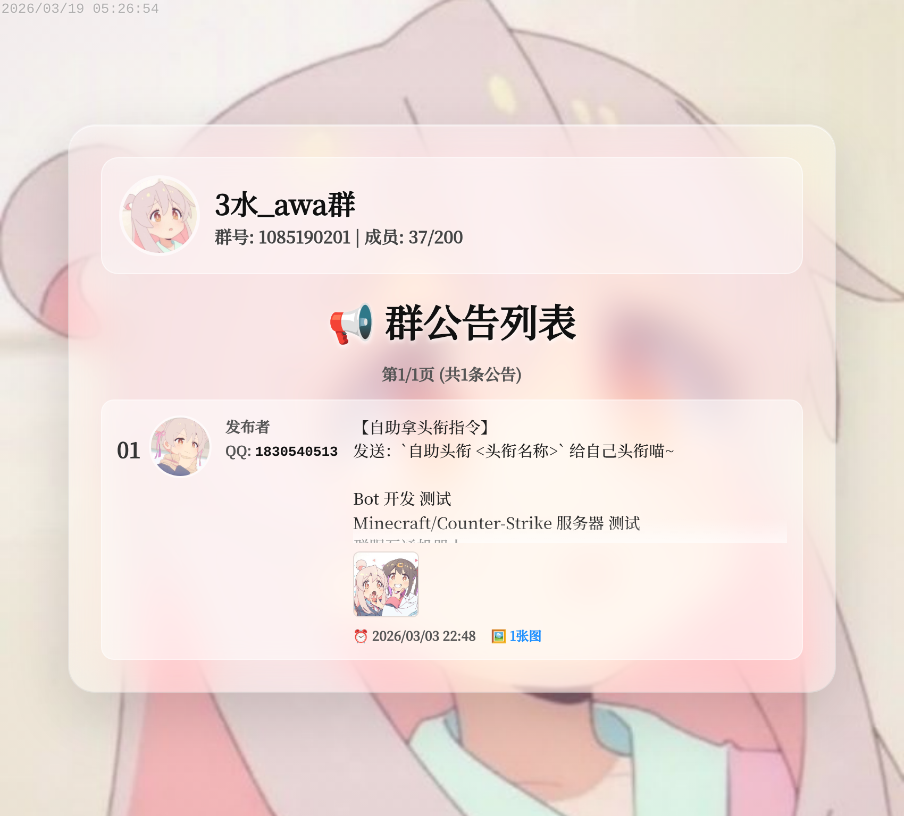
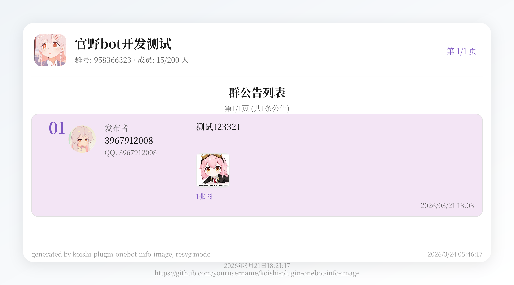
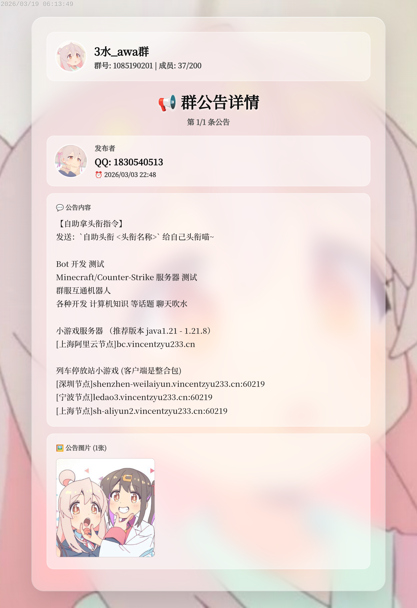
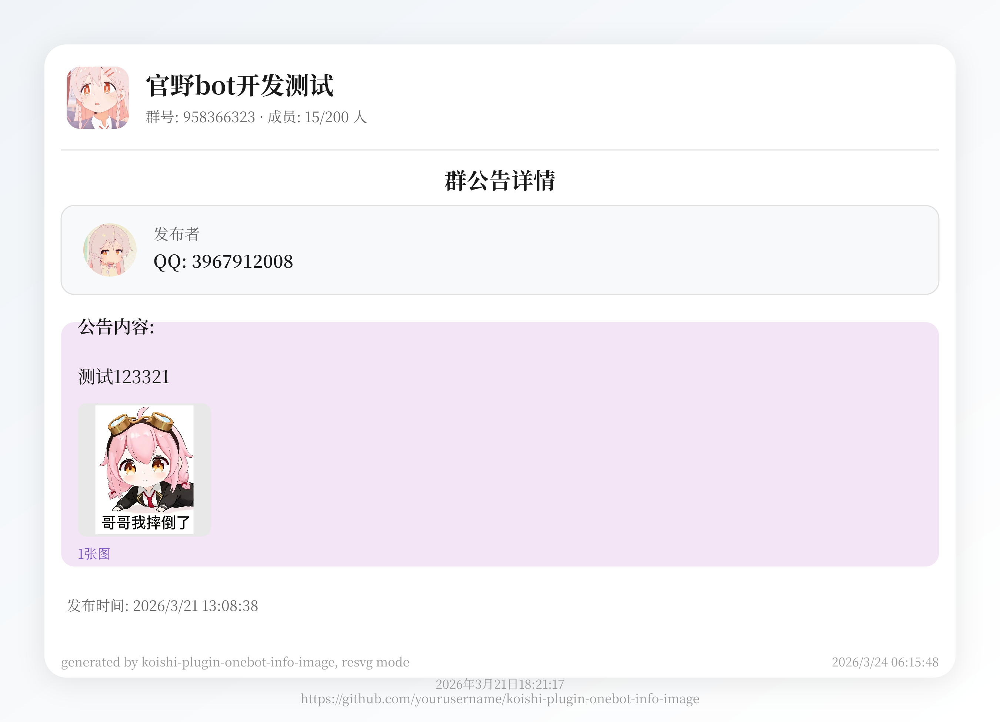
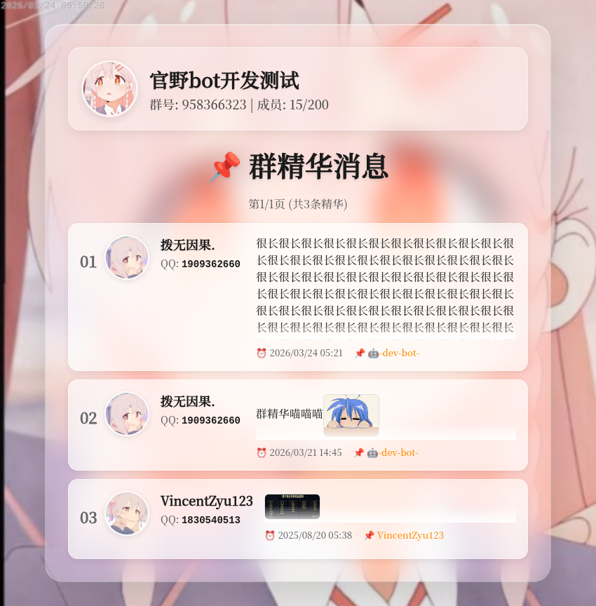
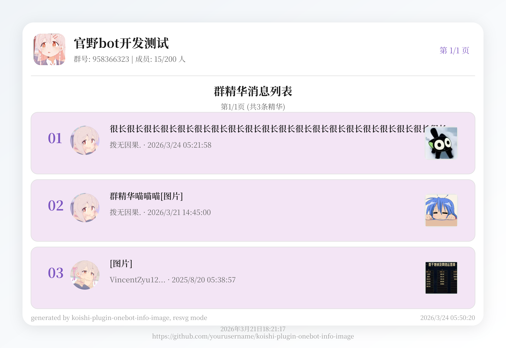
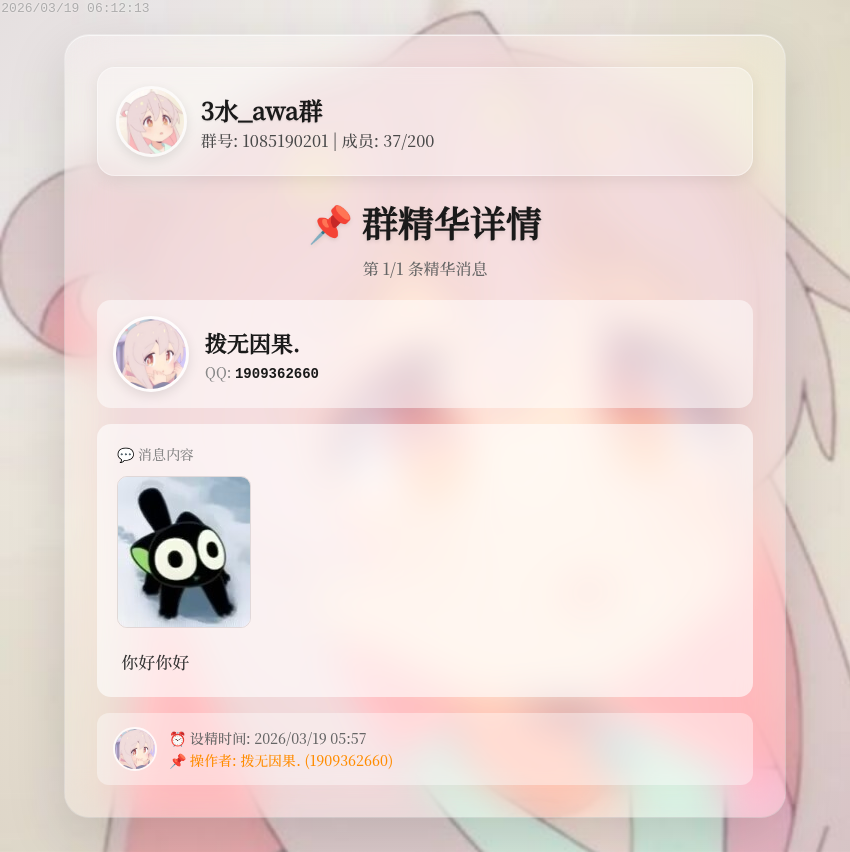
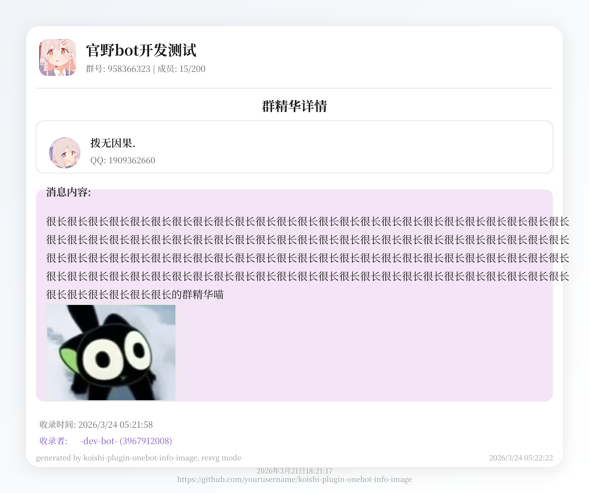

# 📸 所有图片预览

> 本页面展示 koishi-plugin-onebot-info-image 插件的所有渲染效果预览图

---

## 📋 目录

- [Napcat 用户信息 (AUI)](#-napcat-用户信息-aui)
- [Napcat 群管理员列表 (AL)](#-napcat-群管理员列表-al)
- [Napcat 群公告](#-napcat-群公告)
- [Napcat 群精华](#-napcat-群精华)

---

##  Napcat 用户信息 (AUI)

### 默认样式

### LXGW 字体

### Flat 样式

### SVG 渲染

---

## 👥 Napcat 群管理员列表 (AL)

### 默认样式

### LXGW 字体

### Flat 样式

### SVG 渲染

---

## 📢 Napcat 群公告

### 群公告列表

#### Source 样式

#### SVG 渲染

### 群公告详情

#### Source 样式

#### SVG 渲染

---

## ⭐ Napcat 群精华

### 群精华列表

#### Source 样式

#### SVG 渲染

### 群精华详情

#### Source 样式

#### SVG 渲染

---

## 📝 说明

- **Source**: 使用 Source Serif Hans 字体渲染（同时也是"原始"样式的双关 😉）
- **LXGW**: 使用霞鹜文楷字体渲染
- **Flat**: 扁平化样式渲染
- **SVG**: 使用 SVG 矢量图形渲染

> 💡 提示：所有图片均使用 Napcat 平台进行渲染测试
