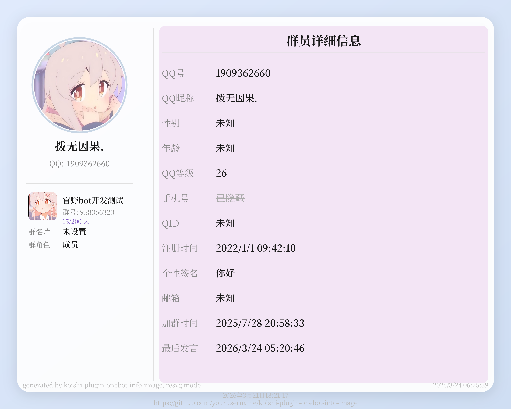
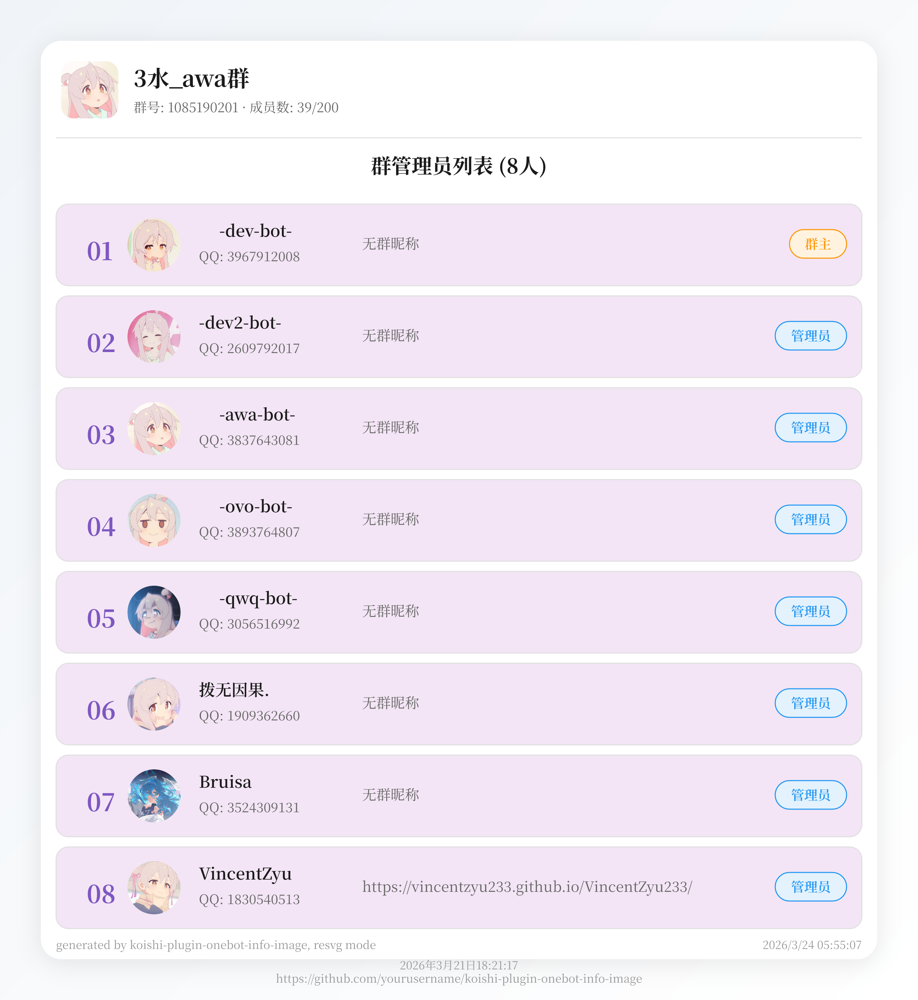
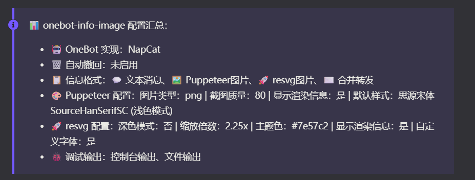

# koishi-plugin-onebot-info-image

[](https://www.npmjs.com/package/koishi-plugin-onebot-info-image)
[](https://www.npmjs.com/package/koishi-plugin-onebot-info-image)
[](https://github.com/VincentZyuApps/koishi-plugin-onebot-info-image)
[](https://gitee.com/vincent-zyu/koishi-plugin-onebot-info-image)

<p><del>💬 插件使用问题 / 🐛 Bug反馈 / 👨‍💻 插件开发交流，欢迎加入QQ群：<b>259248174</b>   🎉（这个群G了</del> </p> 
<p>💬 插件使用问题 / 🐛 Bug反馈 / 👨‍💻 插件开发交流，欢迎加入QQ群：<b>1085190201</b> 🎉</p>
<p>💡 在群里直接艾特我，回复的更快哦~ ✨</p>


# 获取成员信息/管理员列表/群公告/群精华，发送文字/图片/合并转发消息，仅支持OneBotV11

> 推荐使用[Napcat](https://napneko.github.io/)
> 
> 
>
> 开发时仅适配了 **Napcat** 和 **Lagrange** 协议，**llonebot** 未适配。
> 部分 llonebot API 返回的 JSON 格式与 Napcat 相同，可尝试使用。
> 若需适配其他协议，欢迎提 issue 或进群艾特我反馈~

### ⚙️ 必须依赖
本插件需要以下依赖才能正常工作：
- **http** - Koishi 内置服务，用于 HTTP 服务器功能
- **puppeteer** - Koishi 服务，用于 Puppeteer 渲染图片
- **notifier** - Koishi 服务，用于 WebUI 通知显示
- **console** - Koishi 服务，用于 WebUI 功能（可选）
- **@resvg/resvg-js** - npm 包，用于 resvg 轻量级 SVG 渲染（快速出图推荐！）

#### Napcat 平台渲染效果:
##### 用户信息：




##### 群管理列表：




> 📸 查看更多渲染效果预览图：[所有图片的预览捏](docs/所有图片的预览捏.md)

--- 

## 更新日志

- **0.5.4-beta.1+20260329** 📊
  - ✨ **WebUI 配置汇总通知**
    - 插件启动时在 WebUI 的 紫色Notifier模块 显示完整配置汇总
    - 支持 OneBot 实现平台、自动撤回配置显示
    - 支持信息格式（文本/Puppeteer/resvg/合并转发）显示
    - 支持 Puppeteer 渲染详细配置（图片类型、质量、样式等）显示
    - 支持 resvg 渲染详细配置（深色模式、缩放、主题色等）显示
    - 支持调试输出配置显示
    - 
  - 🔧 **依赖调整**
    - 将 `puppeteer` 服务从必需改为可选依赖
    - 添加 `notifier` 服务到可选依赖
  - 📝 **文档优化**
    - 在 LICENSE 中添加项目名称和 GitHub/Gitee 地址
    - 为字体使用声明中的字体名称添加跳转链接
    - 优化文档结构，方便用户访问项目源码和字体仓库

> 🚀 **重磅更新：SVG 轻量级渲染 mode 上线！** _——2026年3月24日08:51:59_  
> 使用 **resvg** 渲染 SVG图片，**比 Puppeteer出图 更快，资源占用更低！**强烈推荐开启~ ✨

- **0.5.3-beta.1+20260326** 🔤
  - ✨ **新增 SVG 自定义字体配置**
    - 新增 `svgEnableCustomFont` 开关，默认关闭
    - 开启后 `svgFontFiles` 和 `svgFontFamilies` 配置才会生效
    - 关闭时使用系统默认字体 `sans-serif`
    - 默认字体路径新增 Windows 系统支持
  - 📊 **渲染信息增强**
    - Puppeteer 渲染信息新增：样式名称、黑暗模式状态
    - resvg 渲染信息新增：字体文件名、font-family
    - 未启用自定义字体时显示「默认」
- **0.5.2-beta.2+20260326** 📢
  - ✨ **WebUI 配置状态通知**
    - 新增注入的 `notifier` 服务，配置变更时实时通知
  - 📚 **文档与依赖**
    - 补充依赖说明
    - 更新 README 文档
- **0.5.1-beta.1+20260324** 🚀
  - ✨ 新增渲染信息显示配置项
    - `imageShowRenderInfo`: 控制 Puppeteer 渲染耗时、类型、质量信息显示
    - `svgShowRenderInfo`: 控制 resvg 渲染耗时、缩放信息显示
  - 🎨 优化渲染提示文字，明确显示「正在使用 Puppeteer 渲染」
- **0.5.0-beta.1+20260324** 🚀
  - ✨ **新增 SVG 轻量级渲染 mode！** 使用 resvg 出图，速度极快，零依赖 Puppeteer！
  - 🎨 统一所有 SVG 文件的主题色为 Koishi 紫 `#7e57c2`
  - 📐 优化 SVG 布局间距，视觉体验更统一
  - 🐛 修复群精华详情 SVG 头像显示问题
  - 💄 调整底部水印区域空隙大小
- **0.5.0-alpha.1+20260319**
  - 🎉 **全新功能：resvg 轻量级 SVG 渲染！** 出图速度飞起，推荐开启~
- **0.4.1-beta.1+20260309**
  - ✨ 新增自动撤回功能 (enableAutoRecall)
  - ✨ 新增 WebUI 预览开关 (enableWebUIPreview)
- **0.4.0-beta.3+20251230**
  - 整理代码结构，现在支持群精华，群公告
  - 调整部分aui的unknown处理
  - 修改aui的获取groupMemberInfo的判断条件的逻辑
- **0.3.1-beta.1+20251219**
  - 微调flat模板 aui的样式捏
- **0.3.0-beta.1+20251219**
  - 增加配置页面webui里面嵌入的html预览捏
- **0.2.3-beta.1+20251218**
  - 手机号可以强制隐藏捏
- **0.2.2-beta.1+20251218**
  - 新增：aui指令允许使用qq号进行查询
- **前面的版本号**
  - 忘了。反正你看到的features都是前面更新的

--- 

## dev 
### 查看git大文件
```shell
git rev-list --objects --all | git cat-file --batch-check='%(objecttype) %(objectname) %(objectsize) %(rest)' | Where-Object { $_ -match '^blob' } | ForEach-Object { $parts = $_ -split ' ', 4; [PSCustomObject]@{ Size = [int]$parts[2]; Name = $parts[3] } } | Sort-Object Size -Descending | Select-Object -First 20 

git rev-list --objects --all | git cat-file --batch-check='%(objecttype) %(objectname) %(objectsize) %(rest)' | Where-Object { $_ -match '^blob' } | ForEach-Object { $parts = $_ -split ' ', 4; [PSCustomObject]@{ Size = [int]$parts[2]; File = $parts[3] } } | Sort-Object Size -Descending | Select-Object -First 20 | ForEach-Object { "{0,10} KB  {1}" -f ([math]::Round($_.Size/1KB, 2)), $_.File }
```

### 发布到git workflow
#### 开发环境：
```shell
cd G:\GGames\Minecraft\shuyeyun\qq-bot\koishi-dev\koishi-dev-3\external\onebot-info-image
git add .
git commit -m "message"
git push origin main
```
#### 生产环境:
```shell
cd /home/bawuyinguo/SSoftwareFiles/koishi/awa-bot-3/external
git clone https://gitee.com/vincent-zyu/koishi-plugin-onebot-image
cd /home/bawuyinguo/SSoftwareFiles/koishi/awa-bot-3/external/koishi-plugin-onebot-image
git pull
cd /home/bawuyinguo/SSoftwareFiles/koishi/awa-bot-3
yarn && yarn build
yarn
```

### 发布到npm workflow
```shell
# ensure plugin dir name is *onebot-info-image*, without koishi-plugin prefix then:
cd G:\GGames\Minecraft\shuyeyun\qq-bot\koishi-dev\koishi-dev-3
yarn
yarn dev
yarn build onebot-info-image

$Env:HTTP_PROXY = "http://127.0.0.1:7890"
$Env:HTTPS_PROXY = "http://127.0.0.1:7890"
Invoke-WebRequest -Uri "https://www.google.com" -Method Head -UseBasicParsing
npm login --registry https://registry.npmjs.org
# login npm in browser
npm run pub onebot-info-image -- --registry https://registry.npmjs.org
npm dist-tag add koishi-plugin-onebot-info-image@0.4.0-beta.3+20251230 latest --registry https://registry.npmjs.org

npm view koishi-plugin-onebot-info-image
npm-stat.com
```